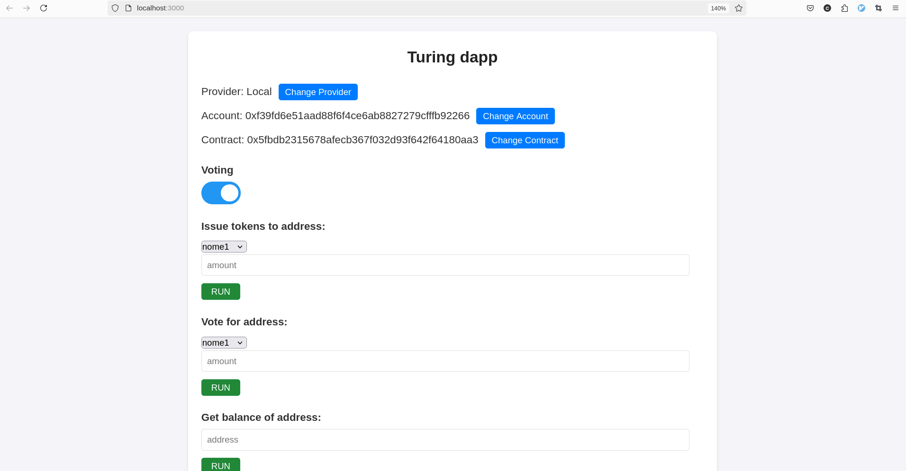

# dapp-turing
This is a dapp for my blockchain class

This app interacts with a chain/a wallet (such as metamask) through
'ethers.js' (using its WebProvider class)

The frontend was made using react v19

most of the styling was generated with chatgpt and i tweaked it a little bit

'hardhat' was mainly used to deploy a local blockchain for testing and also to
deploy this dapp through *ignition* (refer to [their docs](https://hardhat.org/ignition/docs/reference/cli-commands)
for further explanation)

and i used 'chai' for testing :)


## screenshots





## how to run this app
```bash
# cd to where you cloned this repo
cd /path/to/this/repo

# install dependencies
yarn

# clear any previous deploy
yarn run clean

# generate the contract artifacts and copy them to ./frontend/src
yarn run compile

# start the local chain with hardhat at http://127.0.0.1:8545
yarn run node &

# deploy the contract to the local chain using hardhat-ignition
yarn run deploy

# open the frontend at <http://localhost:3000>
yarn run frontend
```


## how to redeploy the contract?
```
yarn run clean
yarn run deploy
```


## how to redeploy the contract to a different network?
Change the `defaultNetwork: "localhost"` option from `hardhart.config.js` to
something else and redeploy


## references
Metamask
* [how to connect metamask to a json provider - Metamask](https://docs.metamask.io/wallet/how-to/run-devnet/)
* [Provider - Metamask](https://docs.metamask.io/wallet/reference/provider-api/)

Hardhat
* [Tutorial 1 - Hardhat org](https://hardhat.org/tutorial/creating-a-new-hardhat-project)
* [Tutorial 2 - Hardhat org](https://hardhat.org/hardhat-runner/docs/getting-started#overview)
* [Hardhat-Ethers bridge](https://hardhat.org/hardhat-runner/plugins/nomicfoundation-hardhat-ethers)

Solidity
* [Introduction to smart contracts - SolidityLang](https://docs.soliditylang.org/en/v0.8.9/introduction-to-smart-contracts.html)

Ethers
* [Getting Started Ethers V6 - Ethers org](https://docs.ethers.org/v6/getting-started/)
* [Getting Started Ethers V5 - Ethers org](https://docs.ethers.org/v5/getting-started/)

Others
* <https://stackoverflow.com/questions/69971218/what-is-the-difference-between-msg-sender-and-addressthis>

Labs
* [Lab 12](https://jamesbachini.com/solidity-for-beginners/)
* [Lab 13](https://vitto.cc/how-to-create-and-deploy-an-erc20-token-in-20-minutes/)
* [Lab 14](https://pt.w3d.community/fatimalima/como-construir-seu-dapp-usando-a-moderna-ethereum-tech-stack-hardhat-e-ethersjs-20n7)
